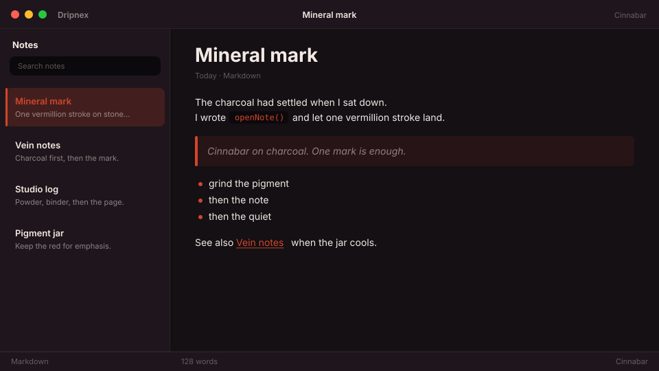

# Cinnabar

Charcoal mineral. Cinnabar vermillion mark.



```
dripnex/theme-cinnabar
```

## Palette

The chips live in [palette.html](palette.html) — open it in a browser. GitHub won’t paint HTML swatches here, so the hex list is below.

| Name | Token | Color | What it’s for |
| --- | --- | --- | --- |
| Base | `--bg-base` | `#141014` | Window background |
| Surface | `--bg-surface` | `#1e161c` | Sidebar and chrome |
| Elevated | `--bg-elevated` | `#2a1f26` | Raised panels |
| Text | `--text-primary` | `#f3e9e4` | Headings and body |
| Muted | `--text-muted` | `#f3e9e4 · rgba(243, 233, 228, 0.52)` | Secondary copy |
| Accent | `--accent` | `#d4452a` | Selection and links |
| Active | `--status-active` | `#d4452a` | Active status |
| Dropped | `--status-dropped` | `#cf6875` | Dropped status |

Pick it for mineral charcoal with a single vermillion mark — not autumn leaf, not cinema noir.
